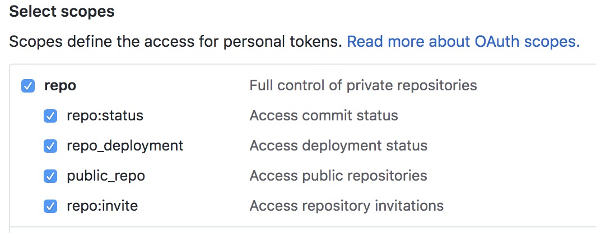

# mp-mimahome 密码管理小程序

## 如何使用

### 使用本人的已经开发好的小程序(小程序搜索【密码Home】)

> 由于个人公众号不能打开网页，所以第1，2步需要在浏览器中完成

1. 登录[Github](http://github.com)(如果没有github帐号，请先注册一个)，在右上角的头像-->Settings-->Developer settings-->Personal access tokens下，点击Generate new token 生成一个访问token


2. 生成token需要勾选repo权限(请保存下来，后面会用到)



3. 进入小程序，点击我的，输入github用户名，第2步中的token，以及加密密钥(加密密钥格式是16位字母或数字)

**重要事情说三遍：**

> 一定要保存好github用户名，token，加密密钥

> 一定要保存好github用户名，token，加密密钥

> 一定要保存好github用户名，token，加密密钥


**备注:**
> github用户名，token，加密密钥都是本地存储的，不会上传到云端，不信的话可以查看源码。(如果还不相信，可以自行部署小程序)


```
例子：
类型: github.com （推荐以网站名，或者你看名字就能知道是哪里的帐号）
帐号：test（用户名）
密码：Test123（密码）
```

